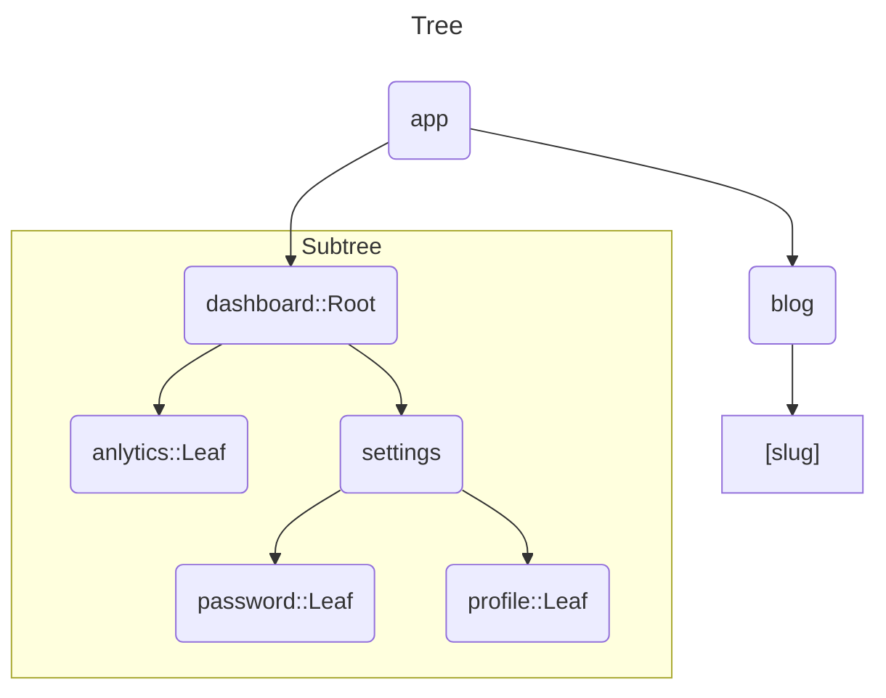

# 라우팅 기초

모든 어플리케이션의 뼈대는 라우팅입니다.

이 페이지에서는 웹에 대한 라우팅의 기초 개념과, Next.js에서 라우팅을 어떻게 다루는지 설명합니다.

---

 

**먼저, 문서 전체에서 사용되는 용어를 보겠습니다.** :

- **Tree** : 계층적 구조를 보여주는 규칙입니다. 예를 들어, 위와 같이 부모, 자식 컴포넌트는 폴더 구조를 보여줍니다.
- **Subtree** : **Tree**의 일부이며, 새로운 *Root(first)* 에서 시작하며, *Leaf(last)* 에서 끝납니다.
- **Root** : **Tree** 혹은 **Subtree**의 첫 번째 노드입니다.
- **Leaf** : **Subtree**에서 자식 노드가 없는 마지막 노드를 의미합니다.

> acme.com / `dashboard` / `settings`
> 
> `Domain` /  `Segment` / `Segment`
> 
> `Segment` / `Segment` => `Path`

- **URL Segment** : `/`에 의해 분리 된 URL path의 일부.
- **URL Path** : `domain(도메인 : ex - localhost:3000)` 이후 따라오는 URL의 일부. 혹은 `Segment`로 이루어진다는 의미.

---

 

