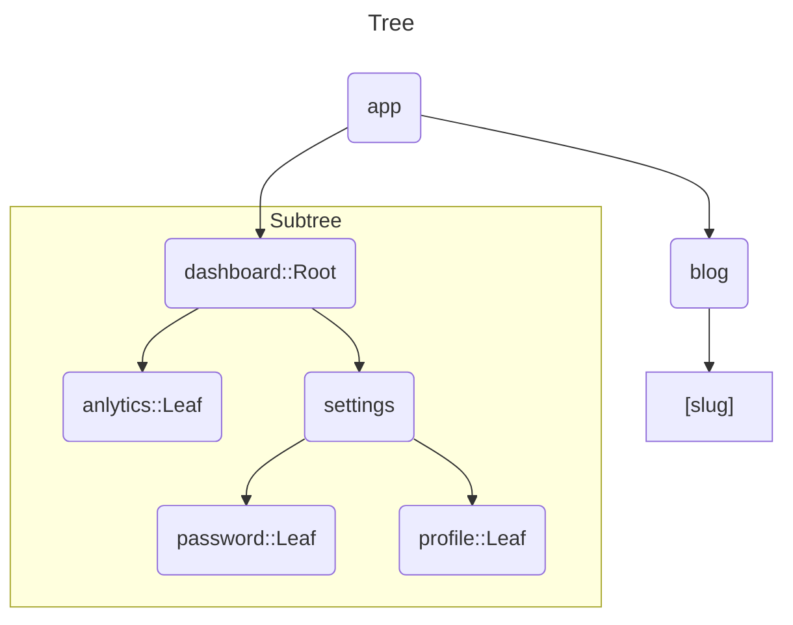

# 라우팅 기초

모든 어플리케이션의 뼈대는 라우팅입니다.

이 페이지에서는 웹에 대한 라우팅의 기초 개념과, Next.js에서 라우팅을 어떻게 다루는지 설명합니다.

---

<br>

**먼저, 문서 전체에서 사용되는 용어를 보겠습니다.** :


- **Tree** : 계층적 구조를 보여주는 규칙입니다. 예를 들어, 위와 같이 부모, 자식 컴포넌트는 폴더 구조를 보여줍니다.
- **Subtree** : **Tree**의 일부이며, 새로운 *Root(first)* 에서 시작하며, *Leaf(last)* 에서 끝납니다.
- **Root** : **Tree** 혹은 **Subtree**의 첫 번째 노드입니다.
- **Leaf** : **Subtree**에서 자식 노드가 없는 마지막 노드를 의미합니다.

> acme.com / `dashboard` / `settings`
> 
> `Domain` /  `Segment` / `Segment`
> 
> `Segment` / `Segment` => `Path`

- **URL Segment** : `/`에 의해 분리 된 URL path의 일부.
- **URL Path** : `domain(도메인 : ex - localhost:3000)` 이후 따라오는 URL의 일부. 혹은 `Segment`로 이루어진다는 의미.

---

<br>

### `app` 라우터 에 관하여

버전 13에서, Next.js는 `React Server Components` 기반으로 구축된 새로운 `App Router`를 발표했습니다.

`App Router`는 `shared layouts`, `nested routing`, `loading states`, `error handling` 등등이 지원됩니다.

<br>

`App Router`는 `app`으로 명명된 새로운 디렉토리에서 작동합니다.

`app` 디렉토리는 점진적인 채택을 허용하기 위해 `pages` 디렉토리와 함께 동작합니다.
> 새로운 `App Router` 사용량을 늘리기 위해, 이전 라우터 사용 방식인 `Pages Router`도 같이 운용되게 만들어, 
> 
> `Page Router` 이용자들에게 새로운 방식인 `App Router`로 유입 될 수 있도록 배려하는 모습으로 보입니다.

```
app
    /...

pages
    /...    
```

기본적으로, `app` 디렉토리 내부의 컴포넌트들은 `React Server Components`입니다.

이러한 것은 성능 최적화 면에서나, 쉽게 이들을 애택할 수 있게 허용합니다. 

또한,  `Client Components`도 사용 할 수 있습니다.

> `React Server Components` : 서버에서 렌더링 되어 사용자에게 제공 => 사용자 최적화 중심
> 
> `React Client Components` : 사용자 환경에서 렌더링 되어 `React` 기반의 `useState`와 같은 변동성 기능들을 유연하게 사용.

---

<br>

## 폴더와 파일의 규칙

<br>

**Next.js는 `파일 시스템` 기반의 라우터를 사용합니다. `:`**

* **폴더**는 주로 라우티를 결정하는 데 쓰입니다. 하나의 라우트는 중첩된 폴더의 하나의 경로입니다.
* **파일** 은 해당 라우트에서 보여지기 위한 UI를 제작하는 데 쓰입니다.

**예시** :

```
app                 --> Root Segment
    /dashboard      --> Segment
        /settings   --> Leaf Segment
```
> acme.com / `dashboard` / `settings`

---

### 중첩된 라우트들

중첩된 라우트를 만들기 위해서, 각 내부에 폴더를 중첩할 수 있습니다.

예를 들어, 새로운 `/dashboard/settings` 라우트를 `app` 폴더에 똑같은 형식으로 폴더를 생성 함으로서 새로운 라우트를 생성 할 수 있습니다.

<br>

`/dashboard/settings` 라우트는 세 개의 세그먼트로 이루어져 있습니다.

* `/` (최상위 세그먼트 : `Root`)
* `dashboard` (세그먼트)
* `settings` (마지막 세그먼트 : `Leaf`)

---

### 파일 규칙들

Next.js는 UI를 만들기 위한 특별한 파일들을 제공합니다.

이 파일은 중첩된 라우트에서 해야 할 세부적인 행동 양식을 제공합니다.

|                |                                                                  |
|----------------|------------------------------------------------------------------|
| `layout`       | 해당 세그먼트와 그 폴더 내부 파일들을 위한 공유 UI <br> : `Header`, `SideMenu` 같은 기능 |
| `page`         | 해당 라우트의 UI이며, 공개적으로 접근 가능하게 만들어 준다.                              |
| `loading`      | 해당 세그먼트와 그 폴더 내부 파일들을 위한 로딩 UI                                   |
| `not-found`    | 해당 세그먼트와 그 폴더 내부 파일들을 위한 `Not Found` UI                          |
| `error`        | 해당 세그먼트와 그 폴더 내부 파일들을 위한 `Error` UI                              |
| `global-error` | 전역적인 `Error` UI                                                  |
| `route`        | 서버 사이드 `API Endpoint`                                            |
| `template`     | 리 렌더링에 전문화 된 `Layout` UI                                         |
| `default`      | 병렬 라우트를 위한 `Fallback` UI                                         |

---

<br>

### 컴포넌트 계층도

라우트 세그먼트의 특수 파일들로 정의된 리액트 컴포넌트는 세부적인 계층도 내부에서 렌더링됩니다.
> 자연스럽게 직역을 못 했지만, 밑의 내용을 보면 이해될 예정...

* `layout.js`
* `template.js`
* `error.js` : (React error boundary)
* `loading.js` : (React suspense boundary)
* `not-found.js` : (React error boundary)
* `page.js` or 중첩된 `layout.js`

```
layout.js
template.js
error.js
loading.js
not-found.js
page.js
```

```tsx

// Component Hierarchy
<Layout> // A
    <Template>
        <ErrorBoundary fallback={<Error/>}>
            <Suspense fallback={<Loading/>}>
                <ErrorBoundary fallback={<NotFound />}>
                    <Page/>
                </ErrorBoundary>
            </Suspense>
        </ErrorBoundary>
    </Template>
</Layout>
```

<br>

중첩 라우터에서, 한 세그먼트의 컴포넌트는 부모 세그먼트에 의해 또다시 중첩됩니다.

**예시** : 

```
/** 폴더 구조 예시 */

/dashboard ==> A
    /layout.js
    /error.js
    /loading.js
    
    /settings ==> B
        /layout.js
        /error.js
        /loading.js
        /page.js
```
하나의 세그먼트를 의미하는 위 폴더 내부의 파일들은, 이런 컴포넌트 계층도를 보입니다.

```tsx

// Component Hierarchy
<Layout> // A
    <ErrorBoundary fallback={<Error/>}>
        <Suspense fallback={<Loading/>}>
            
            <Layout> // B
                <ErrorBoundary fallback={<Error/>}>
                    <Suspense fallback={<Loading/>}>
                        <Page/>
                    </Suspense>
                </ErrorBoundary>
            </Layout>
            
        </Suspense>
    </ErrorBoundary>
</Layout>
```

---

<br>

### 동일 위치 배치

위와 같은 특수 파일 외에도, 스스로 제작한 파일들을 같이 배치 할 수 있습니다.

예시 : `components`, `styles`, `tests`, etc...

<br>

이게 가능한 이유는, 라우트가 폴더로 결정됨에도 불구하고 

`page.js` 혹은 `route.js` 만이 공개적으로 접근 가능한 콘텐츠로 돌아오기 때문입니다.

```text
/app
    /components
        /button.js      --> (/components/button) [X] Not Routable
        
    /lib
        /constants.js   --> (/lib/constants) [X] Not Routable
        
    /dashboard
        /page.js        --> (/dashboard) [O] Routable
        /nav.js         --> (/dashboard/nav) [X] Not Routable
        
    /api
        /route.js       --> (/api) [O] Routable
        /db.js          --> (/api/db) [X] Not Routable
```